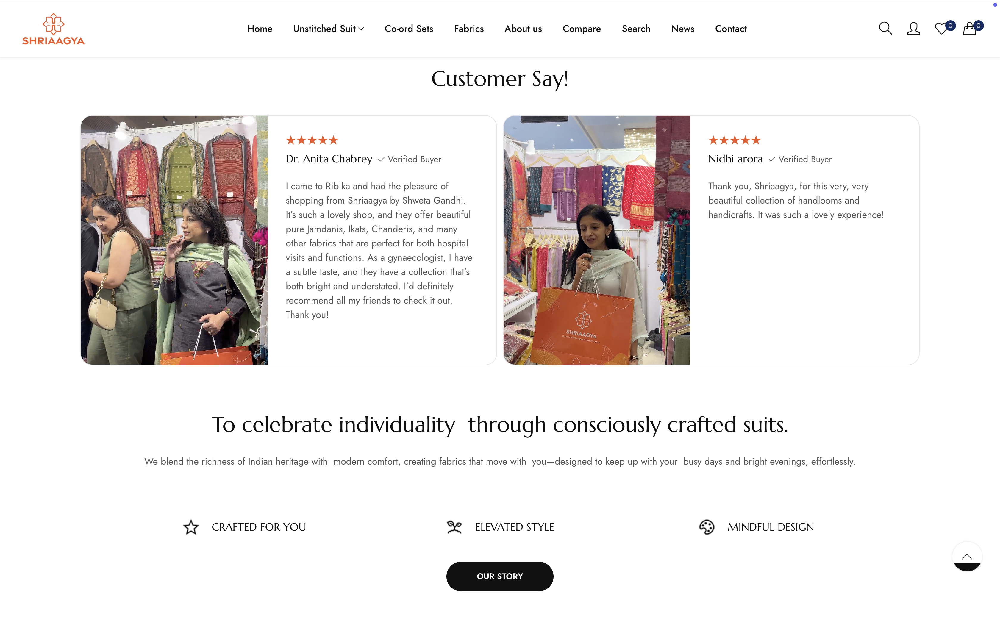
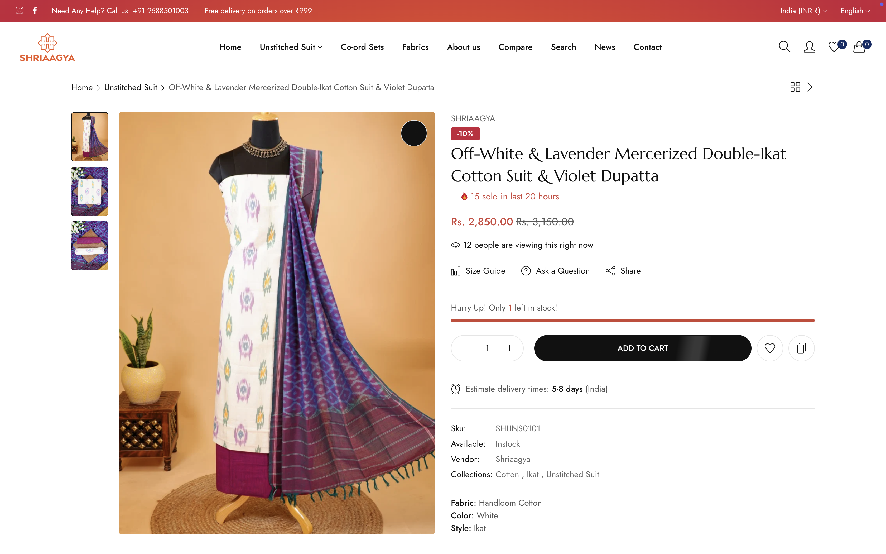
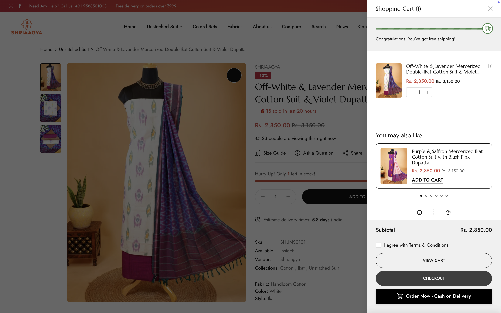
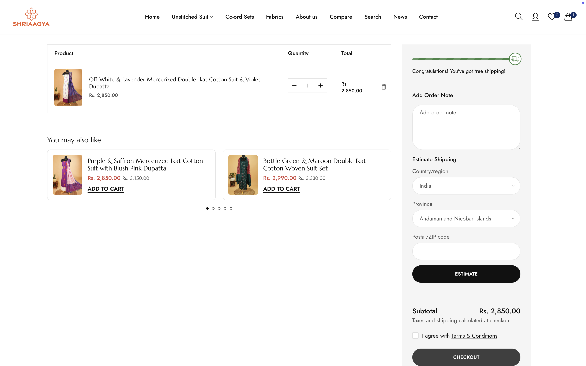
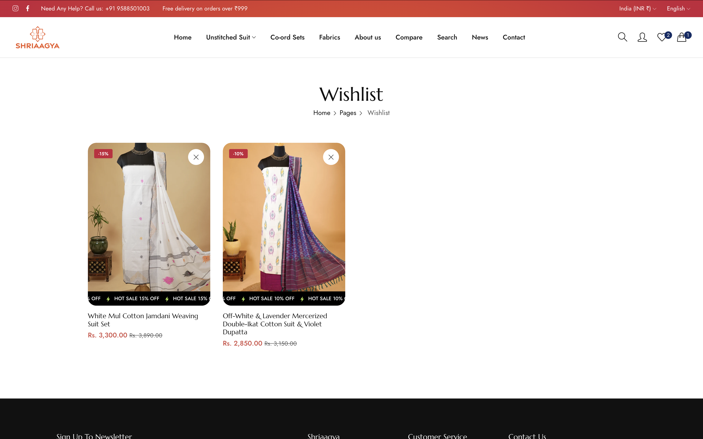
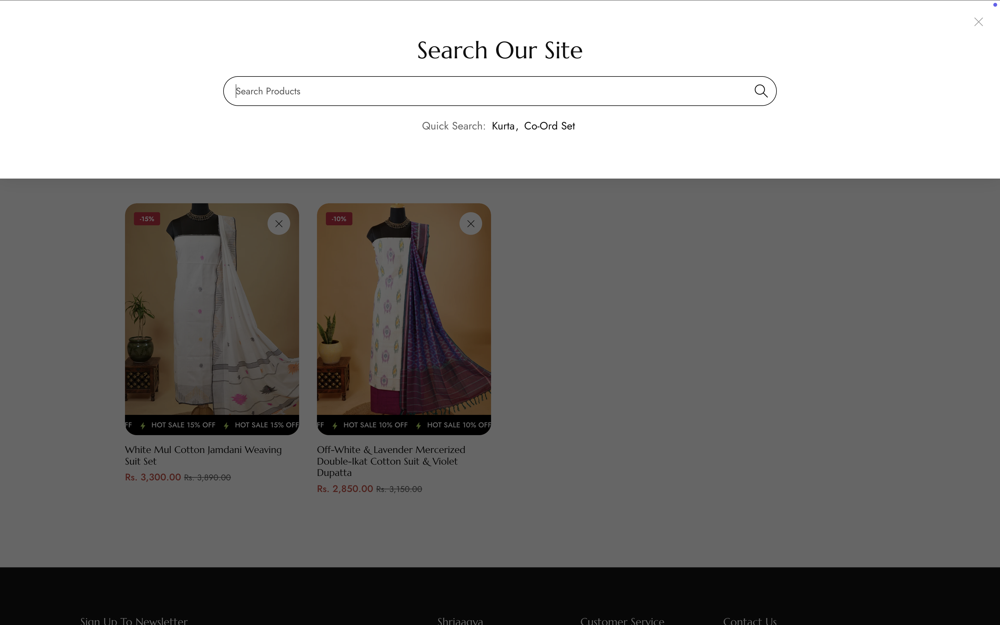

# Shriaagya Shopify Theme

Welcome to the **Shriaagya** custom Shopify theme! This theme is designed to provide a modern, responsive, and highly customizable storefront for your Shopify store.

---

## Table of Contents

- [Overview](#overview)
- [Tech Stack](#tech-stack)
- [Folder Structure](#folder-structure)
- [Installation & Usage](#installation--usage)
- [Theme Customization](#theme-customization)
- [CMS Integration](#cms-integration)
- [Support](#support)
- [Screenshots](#screenshots)

---

## Overview

The Shriaagya theme is built for flexibility and performance, featuring:

- Responsive layouts for all devices
- Customizable sections and blocks
- Modern animations and interactive elements
- Integration with Shopify's Online Store 2.0 features

---

## Tech Stack

- **Shopify Liquid**: Templating language for dynamic content
- **HTML5 & CSS3**: Markup and styling
- **JavaScript (ES6+)**: Interactive features and dynamic UI
- **Shopify Theme Kit / Shopify CLI**: For local development and deployment
- **JSON**: For theme settings and localization
- **Third-party Libraries**: Swiper.js (carousel), PhotoSwipe (gallery), etc.

---

## Folder Structure

```
assets/      # CSS, JS, fonts, images
config/      # Theme settings and data
layout/      # Main layout files (theme.liquid, password.liquid)
locales/     # Language and translation files
sections/    # Customizable page sections
snippets/    # Reusable code snippets
templates/   # Page templates (product, collection, blog, etc.)
```

---

## Installation & Usage

### 1. Upload Theme to Shopify

1. **Download** the theme folder as a ZIP file.
2. Go to your Shopify Admin: `Online Store > Themes`.
3. Click **Upload theme** and select your ZIP file.
4. Once uploaded, click **Actions > Publish** to make it live.

### 2. Local Development (Optional)

- Use [Shopify CLI](https://shopify.dev/docs/themes/tools/cli) for local development:
  ```sh
  shopify theme serve
  ```
- Make changes in your local files and preview them in real-time.

---

## Theme Customization

### Sections & Blocks

- All major pages (home, product, collection, blog) are built using **sections** and **blocks**.
- Customize each section via Shopify's theme editor:
  - Add, remove, or reorder sections
  - Change images, text, colors, and layout options

### Theme Settings

- Located in `config/settings_schema.json`
- Control global styles, fonts, colors, and more from the **Theme Settings** panel.

### Translations

- Edit `locales/en.default.json` (and other language files) to update text across the site.

---

## CMS Integration

This theme is fully compatible with Shopify's CMS features:

- **Products**: Manage via Shopify Admin. Product templates support image galleries, videos, 3D models, and variant swatches.
- **Collections**: Use customizable collection templates and filters.
- **Blogs**: Built-in blog and portfolio templates for content marketing.
- **Pages**: Create custom pages using the theme's flexible sections.

**How to Use:**

1. **Add Content**: Use Shopify Admin to add products, collections, blogs, and pages.
2. **Customize Layout**: Open the theme editor (`Online Store > Themes > Customize`) to arrange sections and blocks.
3. **Configure Settings**: Adjust global styles, colors, and typography in the Theme Settings panel.
4. **Preview & Publish**: Preview changes live and publish when ready.

---

## Support

- **Support Email**: kanhagupta.dev@gmail.com

---

## Live Demo

[https://www.shriaagya.com](https://www.shriaagya.com)

---

## Screenshots

Below are some screenshots from the Shriaagya website.

| | |
|---|---|
|  |  |
|  |  |
|  |  |
|  |  |
|  |  |
|  |  |